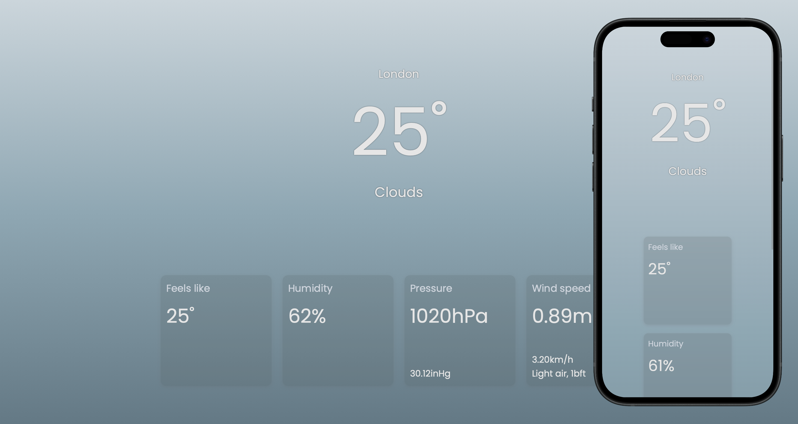

# TinyWeather

TinyWeather is a minimalistic application for displaying the current weather in
the selected city. The app allows users to see the current weather conditions
conditions, including temperature, humidity, pressure, wind speed and other
details. It does not provide a weather forecast (due to the limitations of the
free OpenWeather plan), which makes it ideal for quick information about current
conditions.

## Features

-   **Display current weather**: Get information about the current weather
    conditions.
-   **City Change**: Click on the city name to enter a new one to enter a new
    name and get information for another city.
-   **Weather Information**: View data such as temperature, felt temperature,
    humidity, pressure, and wind speed.

## Screenshots

## Technologies Used

-   **React**: For building the user interface.
-   **CSS**: For styling the application.

Made with:

## License

This project is licensed under the MIT License - see the LICENSE file for
details.
